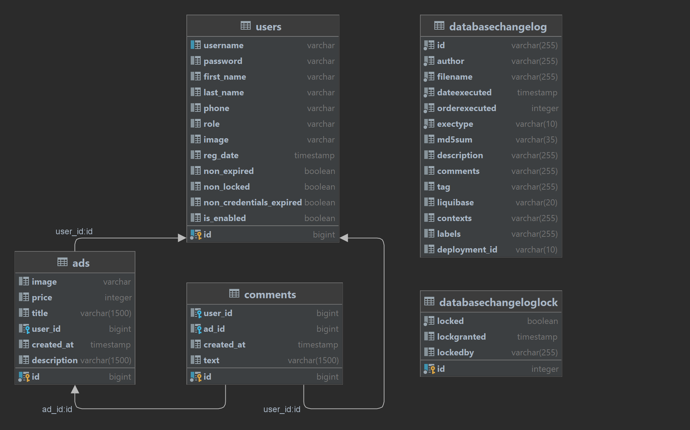

# <u>Online Reselling Project</u>
## We are the PUPPIES development team, an outsourcing company for the development of solutions for the implementationand development of projects in the e-commerce sphere.

<hr>

According to the technical task of the SkyPro company, it is necessary to assemble the backend part of the site in Java.

**The backend part of the project involves the implementation of the following functionality:**

- Authorization and authentication of users.
- Distribution of roles between users: user and administrator*.
- CRUD for ads on the site: the administrator can delete or edit all ads, and users — only their own.
- Under each ad, users can leave reviews.
- In the site header, you can search for ads by name.
- Show and save images of ads.

<hr>

### The front-end functionality is described in [openapi.yaml](openapi.yaml).
### Command to start the front: 
```
docker run --rm -p 3000:3000 ghcr.io/bizinmitya/front-react-avito:v1.19
```

<hr>

### Entity relationship diagram:



<hr>

### We have 6 weeks to develop the entire project, after which we will transfer the finished solution to SkyPro for use.
### Project stages (1 stage = 1 week)

**Stage I:**
>Setting up the Spring project.

**Stage II:** 
>Authorization and authentication setup.

**Stage III:** 
>Description of ad models and reviews.

**Stage IV:** 
>Definition of permissions to controllers.

**Stage V.** 
>Saving and receiving images.

**Stage VI:** 
>Final revision of the project and creation of the presentation.

<hr>

### Development team PUPPIES
### 4 junior developers are taking part in the development of this project:

**1. [Oleg Metelev](https://github.com/skygroundwater)**

**2. [Anton Ryabinin](https://github.com/Ryabinin85)**

**3. [Bulkanov Gleb]()**

**4. [Sokolov Gleb](https://github.com/GlSokolov)**

<hr>

### Development tools:
```
* IntelliJ IDEA
* Java 17
* org.springframework.boot
* org.springframework.data
* org.springframework.security
* org.springframework.kafka
* org.springdoc
* org.liquibase
* org.junit.jupiter
* org.projectlombok
* org.testcontainers
* org.apache.commons
* io.swagger.core.v3
* Build with org.apache.maven
```
<hr>

### TEAM PUPPIES
```
⠄⠄⠄⠄⠄⠄⣠⢿⡄⠄⠄⠄⠄⠄⠄⠄⠄⠄⠄⠄⠄⢀⡿⣄
⠄⠄⠄⠄⠄⣰⢳⡌⣿⢀⣀⣀⣀⠄⠄⠄⠄⢀⣀⣀⡀⡞⢠⣎⣆
⠄⠄⠄⠄⢸⣣⣿⣧⠛⠉⠉⠄⠈⠉⠉⠉⠉⠉⠁⠈⠉⠁⢴⣧⣌⡆
⠄⠄⠄⠄⣾⣻⠛⠁⠄⠄⠄⠄⠄⠄⠄⠄⠄⠄⠄⠄⠄⠄⠈⢛⣿⣷
⠄⠄⠄⠄⣿⡏⠄⠄⠄⠄⠄⠄⠄⠄⠄⠄⠄⠄⠄⠄⠄⠄⠄⢰⣿⣿
⠄⠄⠄⠄⣿⣷⡤⠄⠄⠄⠄⠄⠄⠄⠄⠄⠄⠄⠄⠄⠄⠄⢹⣾⣿⣿
⠄⠄⠄⠄⡿⣏⣧⣤⣀⣀⠄⠄⠄⣺⠄⢠⡏⠄⠄⠄⣀⣤⣤⣽⣿⣿
⠄⠄⠄⢰⢷⣿⢿⣷⣉⠛⣻⣦⣀⡿⠄⠈⠃⠰⣶⣞⠋⣉⣿⠗⠉⣿⡇
⠄⠄⠄⣾⣸⣯⡴⠈⠙⠛⠛⠋⠁⠄⠬⠭⣗⡀⠹⠿⣿⣫⡅⠄⣠⣿⣿
⠠⣤⡶⢿⣗⣿⣿⣦⠄⠄⠄⠄⠄⠐⠒⠒⠚⢯⡀⠸⣿⣿⣧⣾⣿⣿⣿⣦⣤⠄
⠄⠄⠉⠻⣿⣿⣿⣿⣿⣓⢀⣴⣿⣿⣿⣿⣤⣶⡆⣰⣿⣿⣿⣿⣿⣿⠟⠉
⠄⠄⠄⢀⣿⠙⣿⣿⣿⡛⡿⠛⠛⢻⣿⡿⠛⠛⠋⠘⣻⣿⣿⣿⠋⣿⡀
⣀⣴⣞⣉⣀⣢⢹⣿⣿⣷⡅⠄⢀⣨⣿⣇⣀⡀⠄⣸⣿⣿⣿⡇⣰⣟⣉⣓⣤⣀
⠉⠉⠉⠉⠉⠻⣦⡻⣿⣿⣿⣦⣿⣿⣿⡿⢿⣿⣾⣿⣿⣿⣿⣷⠏⠉⠉⠉⠉
⠄⠄⠄⠄⠄⣰⠋⣹⣦⣝⡻⠿⣿⣿⡿⠿⠿⠿⢻⣿⣿⣿⡿⠻⣆
⠄⠄⠄⠄⣼⡷⠟⠛⠙⠻⣿⠷⣶⣶⣶⣶⣶⣶⣿⣿⠟⠋⠛⠲⢮⣧
⠄⠄⠄⠄⠁⠄⠄⠄⠄⠄⢸⢀⡴⠋⠉⠉⠹⢇⢀⡇⠄⠄⠄⠄⠄⠄⠁
⠄⠄⠄⠄⠄⠄⠄⠄⠄⠄⢸⡟⠁⠄⠄⠄⠄⠈⢻⡇
```

